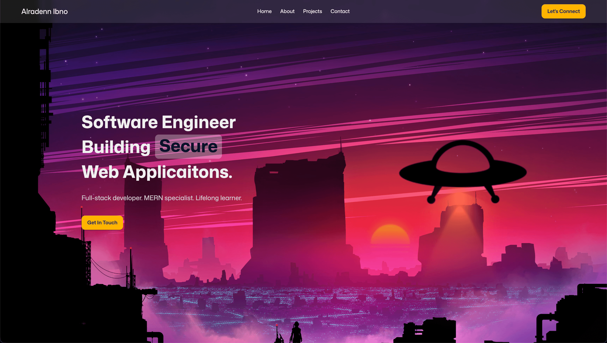
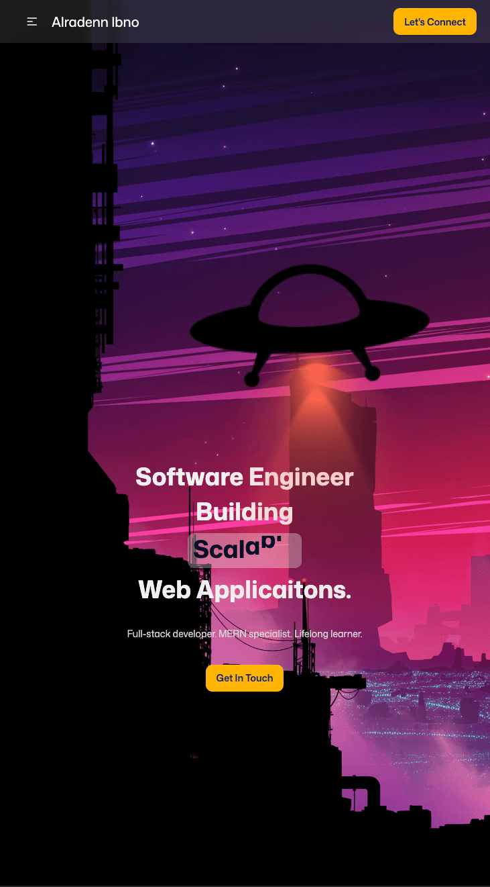

# My Portfolio

#### showcases projects I made

## LINK: [my portfolio]()

## Screenshots

 

## Tech Stack

### vite+react, tailwind css, and Motion

#### I chose vite for its automated and optimized production build

## Key Features

- Responsive Design
- SEO Optimization

## What I learned

- To use ui and animation libraries
- Learned about social previews and how to use tags for SEO optimization
- First time using vercel
- Used tinypng to optimize images used in this website
